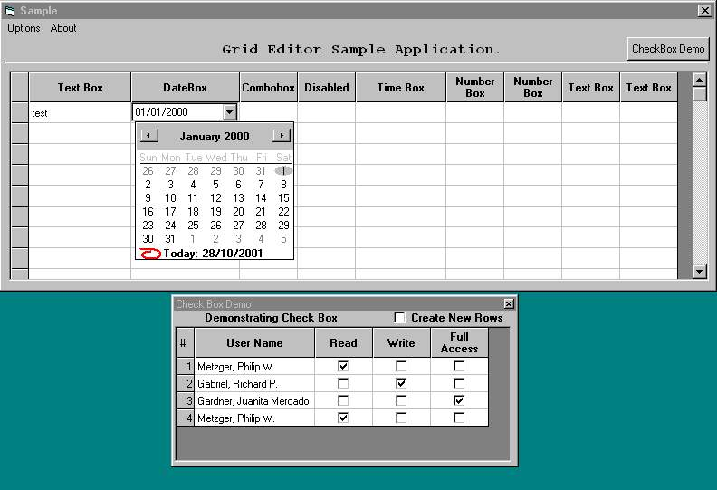



## Grid Editor ActiveX Control

### Description

This is an Updated ActiveX control in which the user can directly edit, print as well as save an MS-Flex Grid control. The programmer can insert various controls like textbox,date control,combobox,check box and time control. There is one more control called Picklist Control....

Please Vote Me...
 
### More Info
 

             |
---                |---
**Submitted On**   |2002-05-17 11:52:02
**By**             |[SHAHIM\.A\.C \(Indian\-Kerala\)](https://github.com/Planet-Source-Code/PSCIndex/blob/master/ByAuthor/shahim-a-c-indian-kerala.md)
**Level**          |Advanced
**User Rating**    |4.6 (138 globes from 30 users)
**Compatibility**  |VB 5\.0, VB 6\.0, ASP \(Active Server Pages\) 
**Category**       |[OLE/ COM/ DCOM/ Active\-X](https://github.com/Planet-Source-Code/PSCIndex/blob/master/ByCategory/ole-com-dcom-active-x__1-29.md)
**World**          |[Visual Basic](https://github.com/Planet-Source-Code/PSCIndex/blob/master/ByWorld/visual-basic.md)
**Archive File**   |[Grid\_Edito840085162002\.zip](https://github.com/Planet-Source-Code/shahim-a-c-indian-kerala-grid-editor-activex-control__1-28450/archive/master.zip)

